# Проект 1. Анализ резюме из HeadHunter

## Оглавление 
0. Датасет: [Google Drive ссылка](https://drive.google.com/file/d/1Kb78mAWYKcYlellTGhIjPI-bCcKbGuTn/view)
1. [Описание проекта](#описание-проекта)  
2. [Какой кейс решаем](#какой-кейс-решаем)  
3. [Краткая информация о данных](#краткая-информация-о-данных)  
4. [Этапы работы над проектом](#этапы-работы-над-проектом)  
5. [Результаты](#результаты)  
6. [Выводы](#выводы)  

---

### Описание проекта    
⭐ Компания HeadHunter хочет построить модель, которая бы автоматически определяла примерный уровень заработной платы, подходящей пользователю, исходя из информации, которую он указал о себе. Но, как вы знаете, прежде чем построить модель, данные необходимо преобразовать, исследовать и очистить. В этом и состоит наша с вами задача!

[↑ Вернуться к оглавлению](#оглавление)

---

### Какой кейс решаем    
Внимательно изучить детали задачи.
Скачать уже знакомый датасет и ноутбук-шаблон.
Обязательно ознакомиться с дополнительным теоретическим материалом, который даётся перед заданием.
Воспользоваться нашими советами и подсказками при выполнении проекта.
Ответить на все контрольные вопросы: за них вы можете максимально набрать 30 баллов на платформе.
Загрузить ноутбук со своим решением на GitHub, оформив его в соответствии с требованиями.
Сдать проект на проверку и получить 10 баллов (из них 8 баллов — за основное задание и 2 балла — за дополнительное) за выводы по разведывательному анализу.
Получить обратную связь от команды курса.

**Условия соревнования:**  
- Компьютер загадывает целое число от 0 до 100.
- Алгоритм получает информацию, больше или меньше загаданное число.
- Необходимо реализовать стратегию, которая покажет наилучший результат в среднем.

**Метрика качества:**  
- Среднее количество попыток за 1000 запусков.

**Что практикуем:**  
- Навыки написания оптимального кода на Python  
- Базовые алгоритмы поиска

[↑ Вернуться к оглавлению](#оглавление)

---

### Краткая информация о данных  
Датасет: [Google Drive ссылка](https://drive.google.com/file/d/1Kb78mAWYKcYlellTGhIjPI-bCcKbGuTn/view)  
-Выгрузка по валютам у меня осталась на другом компьютере (извиняюсь доступа пока нету)

[↑ Вернуться к оглавлению](#оглавление)

---

### Этапы работы над проектом  
-решить 10 задачь, каждая из которых интересная, но требует времени

[↑ Вернуться к оглавлению](#оглавление)

---

### Графики
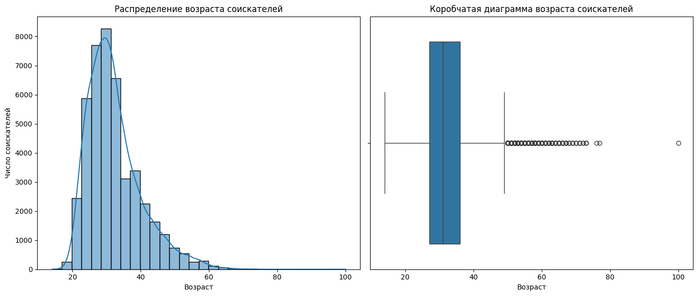
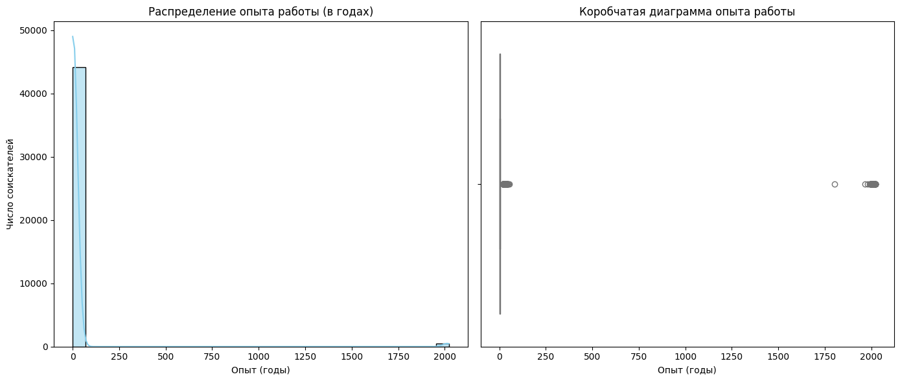
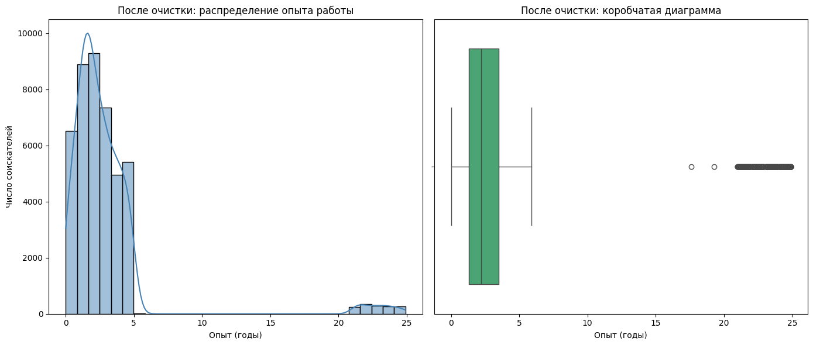
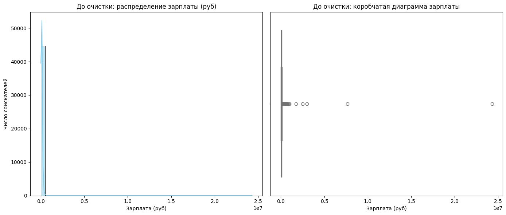
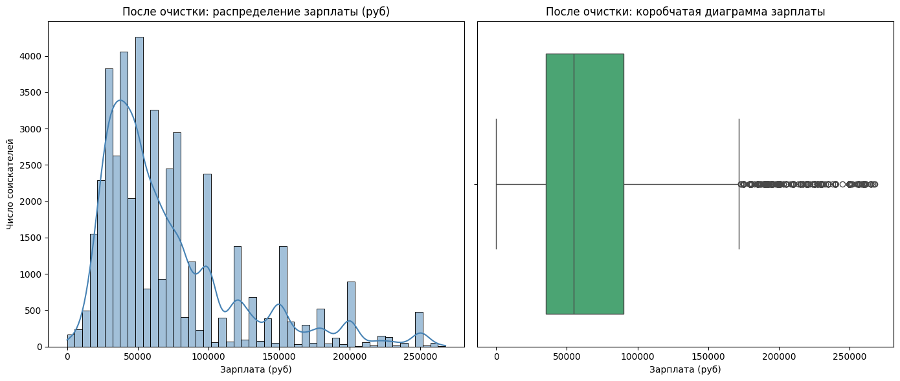
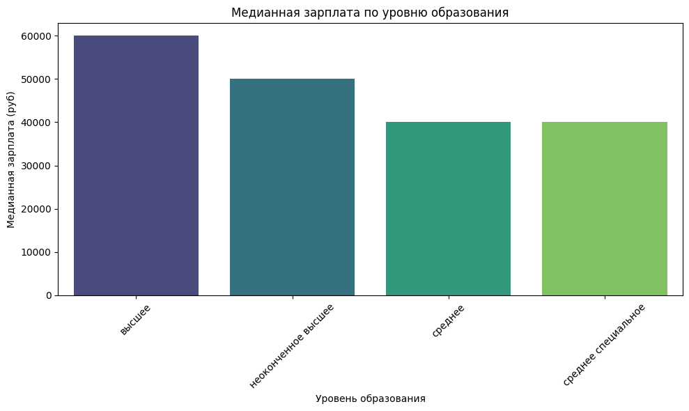
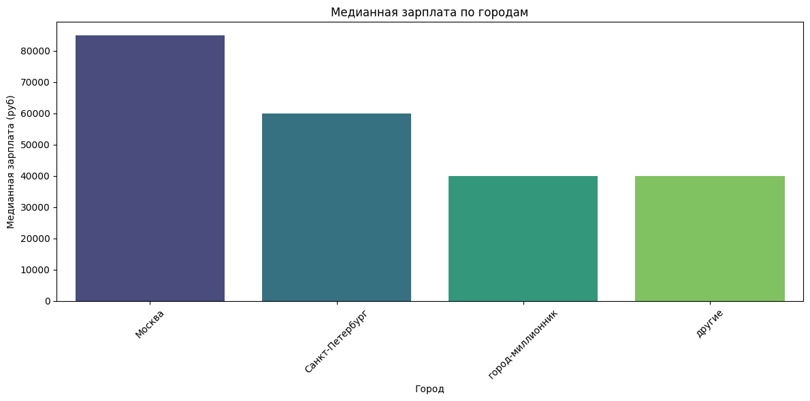
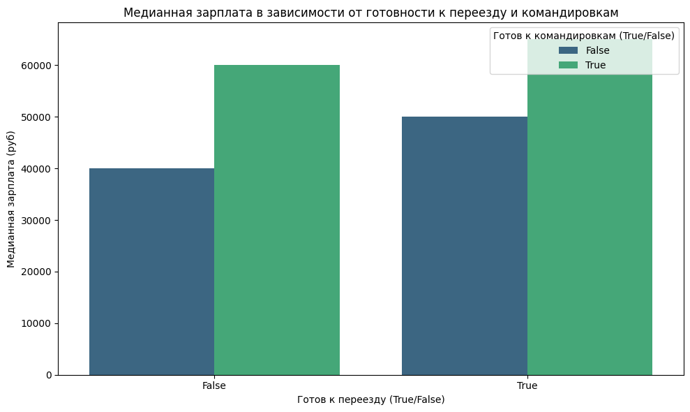
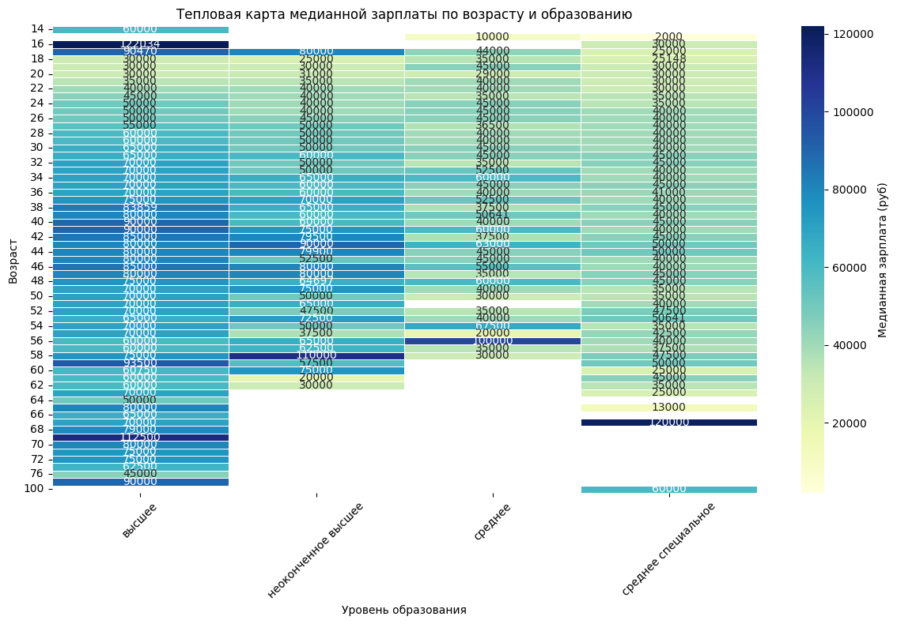
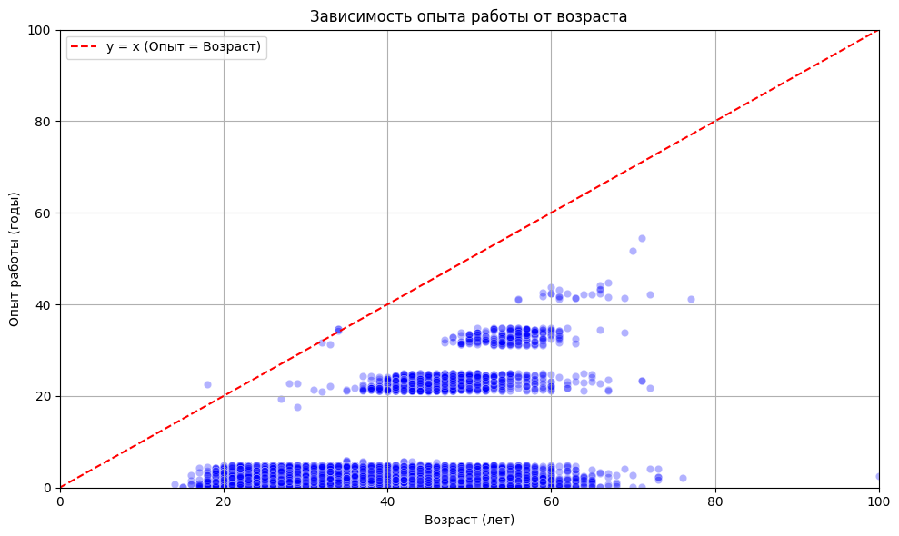
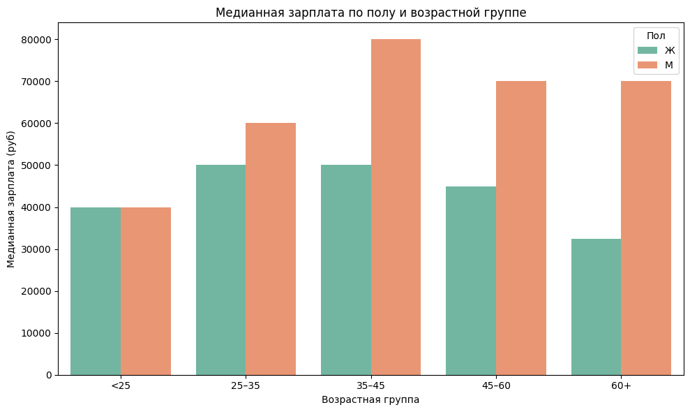
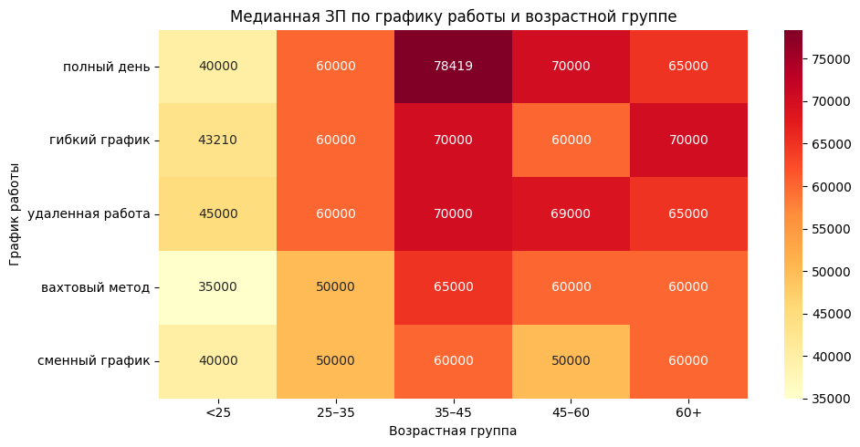
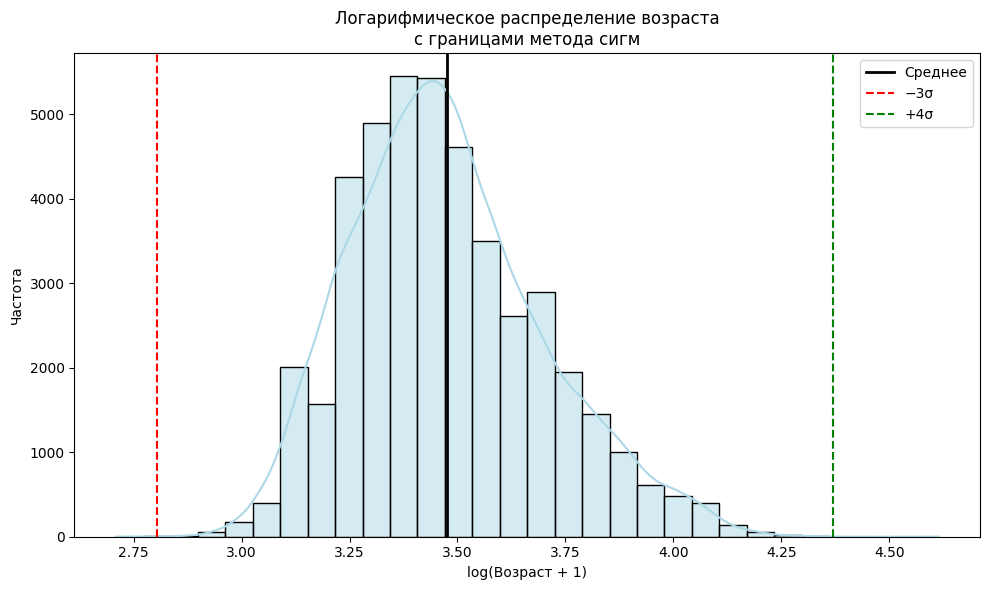

[↑ Вернуться к оглавлению](#оглавление)

---

### Выводы  
<strong style="color:orange"> Мои выводы </strong> 
Основная аудитория — молодые специалисты 25–35 лет.  
Коробка показывает, что основная масса данных лежит в диапазоне примерно от 25 до 40 лет.  
Соискателей старше 60 мало.  
Наблюдаются выбросы вплодь до 100 лет, возможно стоит их исключить.  
Распределение смещено, резкий скачек потом постепенное снижение.  
Из-за выбросов сложно сделать выводы, имеется опыт работы 2000 лет что вероятно ошибка в данных  
После удаления выбросов, можно сказать что пик на 1-3 года, и в основном не более 5 лет. Большой провал до 20 лет. И после 20 небольшой скачек  
После очистки выбросов распределение зарплат стало более нормальным. Коробчатая диаграмма показывает, 
что медиана зарплат находится в районе 100,000 рублей, а 75% соискателей зарабатывают менее 150,000 рублейваши выводы здесь  
Наибольшая зарплата у соискателей с высшим образованием  
Наибольшие ожидание по ЗП в Москве  
Кто готов к переезду имеют более завышенные требование по ЗП, кто готов к командировкам еще более высокие требования  
Ожидание по зарплате наибольшее с высшим образованием и ростут с возрастом примерно до 40 лет, не считая завышенных требований в 16 лет.  
с средним и средне спец образованием - ожидания по ЗП практически не изменны и на одном уровне  
В целом с возрастом опыт растет, наблюдается интересная тендеция - опыт работы как бы группами от 0 до 5, потом 20-23, и 35-38 примерно.  
Большинство соискателей имеют опыт от года до 5 во всех возрастных категориях  
Мужчины ожидают более высокие ЗП особено 60+ )  
Превалирует график работы "полный день" в возрастной категории 35-45 лет  

[↑ Вернуться к оглавлению](#оглавление)
